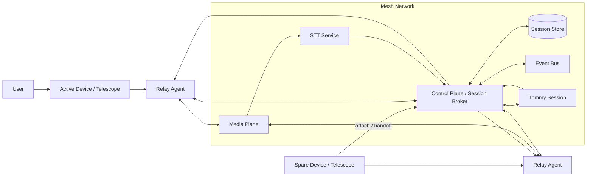
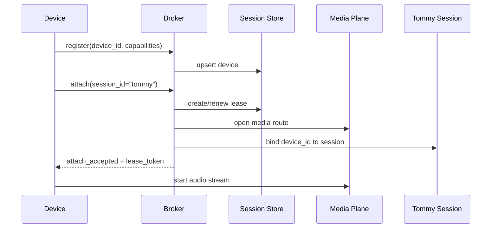
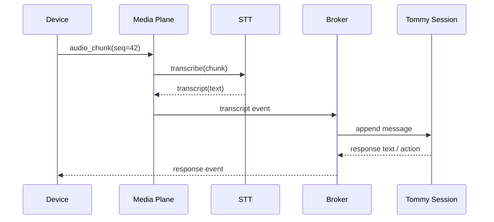
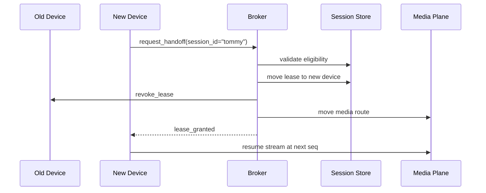
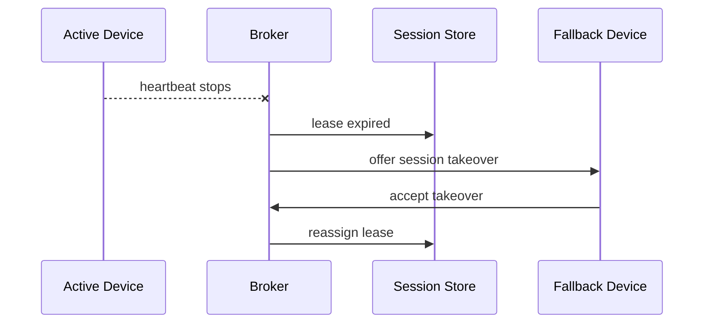

# Tommy Relay Architecture

## Purpose

This document specifies the relay/session design for **Tommy** so the same logical voice session can move across multiple devices in the telescope mesh network without losing state.

### Goals
- Treat **Tommy** as a durable logical session, not a single machine.
- Allow any telescope/device to attach to the session.
- Support safe handoff between devices.
- Keep control/state separate from media transport.
- Preserve audio/transcript continuity across reconnects.
- Provide a robust fallback path when the active device disappears.

### Non-goals
- Replacing the existing single-shot `/capture` flow.
- Rewriting Sophia's current STT, intent, or Neo4j ingest pipeline.
- Implementing low-level WebRTC internals in this doc.

---

## Existing Sophia primitives this design reuses

The current `voice-agent` service already provides useful building blocks:

- `SessionManager` for session lifecycle and audio chunk processing.
- `EventBus` for live event fanout.
- `MeetingTaskStore` for durable background task tracking.
- `/capture` for one-shot uploads plus optional local STT.
- `/events` and websocket event streaming for dashboards/clients.
- `/voice-chat` and `/intent` for transcript-to-response processing.

The relay layer should sit **beside** those primitives and feed them transcripts and session events, rather than replacing them.

---

## Architecture overview



### Control plane
Owns:
- device registration
- active-session leases
- heartbeats
- handoff and failover
- authoritative session state

### Media plane
Owns:
- audio transport
- chunk sequencing
- buffering and resume
- optional realtime voice output

### Session store
Owns:
- durable session metadata
- device presence
- lease state
- replayable transcript/event log

---

## Design rules

1. **Tommy is durable**
   - the session survives device swaps
   - the device is just the current endpoint

2. **One active device per session**
   - prevents double capture and conflicting state

3. **Leases, not locks**
   - active device ownership expires automatically if heartbeats stop

4. **Control is separate from media**
   - attach/switch/release can work even if audio transport changes

5. **Every event is idempotent**
   - repeated messages must be safe to replay

6. **Sequence numbers on audio**
   - required for dedupe, gap detection, and resume

7. **Fallback is always available**
   - if the active telescope fails, the session should continue on another device or degrade to typed input

---

## Sequence diagrams

### 1. Initial attach



### 2. Audio turn



### 3. Device handoff



### 4. Failover



---

## Proposed API

### Device management

#### `POST /relay/devices/register`
Register or refresh a device record.

Request:
```json
{
  "device_id": "device-123",
  "name": "laptop-west",
  "owner_id": "scott",
  "capabilities": ["mic", "speaker", "browser_audio"],
  "platform": "linux",
  "mesh_node": "x1-370"
}
```

Response:
```json
{
  "ok": true,
  "device_id": "device-123",
  "status": "online"
}
```

#### `POST /relay/devices/heartbeat`
Refresh liveness and lease state.

Request:
```json
{
  "device_id": "device-123",
  "session_id": "tommy",
  "lease_token": "lt_...",
  "seq": 91,
  "ts_ms": 1234567890
}
```

### Session control

#### `POST /relay/sessions/{session_id}/attach`
Attach a device to a session.

Request:
```json
{
  "device_id": "device-123",
  "resume_token": "rt_...",
  "preferred_transport": "webrtc"
}
```

Response:
```json
{
  "ok": true,
  "session_id": "tommy",
  "active_device_id": "device-123",
  "lease_token": "lt_...",
  "lease_expires_at": 1234567999,
  "transport": {
    "type": "webrtc",
    "endpoint": "wss://relay.example/ws/tommy"
  }
}
```

#### `POST /relay/sessions/{session_id}/handoff`
Move an active session to a new device.

Request:
```json
{
  "from_device_id": "device-123",
  "to_device_id": "device-456",
  "reason": "manual_switch"
}
```

#### `POST /relay/sessions/{session_id}/detach`
Release a device from the session.

Request:
```json
{
  "device_id": "device-123",
  "lease_token": "lt_..."
}
```

### Audio/media

#### `WS /relay/sessions/{session_id}/stream`
Bidirectional audio stream for the active device.

Client frames:
```json
{
  "type": "audio_chunk",
  "seq": 42,
  "encoding": "opus",
  "sample_rate": 48000,
  "payload_b64": "..."
}
```

Server frames:
```json
{
  "type": "transcript",
  "seq": 42,
  "text": "switch me to the laptop",
  "partial": false
}
```

#### `POST /relay/sessions/{session_id}/audio`
HTTP fallback for audio chunk uploads when websocket/WebRTC is unavailable.

### Observability

#### `GET /relay/sessions/{session_id}`
Return the current broker view of the session.

#### `GET /relay/devices`
List known devices and their liveness.

#### `POST /relay/devices/{device_id}/trust`
Admin-only trust toggle. Requires `x-relay-admin-token` matching `TOMMY_RELAY_ADMIN_TOKEN` or `SOPHIA_RELAY_ADMIN_TOKEN`.

Request:
```json
{"trusted": true}
```

#### `POST /relay/devices/{device_id}/rotate-token`
Admin-only device token rotation. Returns the new raw `device_token` once; only the hash is stored.

#### `POST /relay/devices/{device_id}/revoke`
Admin-only device revocation. Marks the device revoked, clears trust, and parks any active lease owned by that device.

Request:
```json
{"reason": "lost laptop"}
```

#### `GET /relay/dashboard`
Minimal operations page for live device/session visibility and handoff controls.

#### `GET /tommy`
Browser telescope page that can register the current browser, attach to the durable `tommy` session, request microphone access, and use `/relay/sessions/tommy/stream` as the websocket fallback.

#### `POST /relay/sessions/{session_id}/webrtc/offer`
WebRTC negotiation placeholder. It records the offer event and returns `status: not_configured` plus websocket fallback metadata until a real SFU/peer implementation is wired.

#### `GET /relay/events?after_id=...&session_id=...`
Return recent relay events for dashboards.

---

## Data model

### Device
```json
{
  "device_id": "device-123",
  "name": "laptop-west",
  "owner_id": "scott",
  "platform": "linux",
  "capabilities": ["mic", "speaker"],
  "last_seen_ms": 1234567890,
  "status": "online"
}
```

### Session
```json
{
  "session_id": "tommy",
  "owner_id": "scott",
  "active_device_id": "device-123",
  "state": "listening",
  "updated_at_ms": 1234567890
}
```

### Lease
```json
{
  "session_id": "tommy",
  "device_id": "device-123",
  "lease_token": "lt_...",
  "lease_version": 17,
  "lease_expires_at_ms": 1234567999
}
```

### Transcript event
```json
{
  "session_id": "tommy",
  "device_id": "device-123",
  "seq": 42,
  "text": "working on it",
  "source": "stt",
  "ts_ms": 1234567890
}
```

---

## Folder blueprint

Add a new relay package under `src/voice_agent/server/relay/`:

```text
src/voice_agent/server/relay/
├── __init__.py
├── api.py              # FastAPI router for relay endpoints
├── broker.py           # Session/device lease orchestration
├── models.py           # Pydantic request/response models
├── registry.py         # Device registry + liveness cache
├── store.py            # Durable session/lease persistence
├── transport.py        # WebSocket/WebRTC abstraction + fallback HTTP chunking
├── buffer.py           # Audio buffer, resume window, sequence tracking
├── handoff.py          # Move sessions across devices safely
├── events.py           # Relay-specific event publishing helpers
└── tests/
    ├── test_broker.py
    ├── test_handoff.py
    ├── test_registry.py
    └── test_transport.py
```

### Integration points with existing code

- `src/voice_agent/server/app.py`
  - mount `relay.api` as a router
  - publish relay events through the existing `EventBus`
  - optionally bridge transcripts into `SessionManager`

- `src/voice_agent/server/events.py`
  - reuse for `/events` and websocket fanout

- `src/voice_agent/server/session_manager.py`
  - keep the audio processing pipeline stable
  - feed it relay-derived audio or transcript chunks when needed

- `src/voice_agent/server/meeting_task_store.py`
  - continue using it for durable background tasks that outlive a session turn

---

## Implementation status

Implemented in the current relay package:

- device registration with per-device `device_token` and optional enrollment token (`SOPHIA_RELAY_ENROLLMENT_TOKEN` / `TOMMY_RELAY_ENROLLMENT_TOKEN`)
- hashed device/resume/lease token storage while still returning raw one-time tokens to clients
- stricter attach semantics: active sessions cannot be stolen by plain attach; use handoff, resume, or force-handoff
- resume tokens with replay of missed relay events/transcripts
- lease revoke events on handoff/force attach
- duplicate sequence rejection plus gap detection and `/gaps` reporting
- async transcript-to-assistant worker so final transcript persistence is not blocked by LLM latency/failure
- websocket live event push for relay events, plus `heartbeat` and `resume` frames
- fallback-device promotion on expiry when another fresh mic-capable device is available
- relay observability endpoints: `/relay/health`, `/relay/readiness`, `/relay/sessions`, `/relay/sessions/{id}/timeline`
- `tommy-relay-agent` CLI scaffold for device registration, attach, heartbeat, transcript, and audio-file fallback

Remaining future hardening:

- WebRTC media plane with Opus and jitter buffer
- encrypted rolling audio buffer/retransmit window
- browser/mobile relay UI around the same APIs
- explicit admin authorization for `/force-handoff` beyond device-token trust
- multi-process worker/backpressure strategy if the service is scaled horizontally

---

## Suggested implementation phases

### Phase 1 — Broker skeleton
- device registry
- session records
- lease issuance and expiry
- `/relay/sessions/{session_id}/attach`
- `/relay/sessions/{session_id}/detach`

### Phase 2 — Audio relay
- websocket stream endpoint
- sequence numbers
- audio chunk buffering
- transcript emission into the existing event bus

### Phase 3 — Handoff and failover
- manual switch
- heartbeat-based timeout
- resume token support
- fallback device promotion

### Phase 4 — Transport hardening
- WebRTC path
- reconnect/resume
- jitter buffer tuning
- telemetry and error events

---

## Reliability requirements

A release is acceptable only if it satisfies all of these:

- Device heartbeats expire leases automatically.
- Duplicate audio frames are ignored by sequence number.
- A device handoff preserves the same `session_id` and transcript history.
- Session state survives broker restart.
- If the active device disconnects, a new device can recover the session.
- Failed uploads or transient transport errors do not destroy the conversation.

---

## Test plan

### Unit tests
- lease creation and renewal
- lease expiry and reassignment
- duplicate sequence rejection
- handoff state transfer
- session restore from store

### Integration tests
- attach device A, stream audio, detach, attach device B
- simulate heartbeat loss and verify failover
- simulate partial transcript delivery and verify idempotency

### Operational checks
- `/healthz` remains green
- `/readyz` reports relay readiness
- `/events` shows relay state transitions
- session restore works after process restart

---

## Recommended next code change

Implement the relay package as a thin broker over the existing Sophia service:

1. add the new router package
2. store device/session/lease state in SQLite first
3. emit relay events through `EventBus`
4. bridge transcripts into `SessionManager`
5. add websocket streaming and handoff

That path gets the architecture working without forcing a rewrite of the current pipeline.
